# FlaskScale: Dynamic Web Application Management

<p align="center">
  
</p>

---

## Index

- [Description and Objective](#description-and-objective)
- [Technologies](#technologies)
- [Data Architecture](#data-architecture)
- [Replication of the Project](#replication-of-the-project)
- [Demonstration](#demonstration)
- [Outcomes](#outcomes)
- [Future Enhancements](#future-enhancements)

---

## Description and Objective

**FlaskScale** is a scalable web application framework built on Flask, designed to manage and optimize web resources seamlessly. Leveraging Docker for containerization and Google Cloud Platform for cloud infrastructure, FlaskScale provides an efficient environment that adjusts to varying user demands. The application ensures high availability and responsiveness through dynamic resource management, making it ideal for businesses and developers looking to optimize performance in real-time.

### Usage

- **E-Commerce Platforms**: Automatically scales resources during high-traffic sales events to ensure smooth transactions.
- **SaaS Applications**: Dynamically allocates resources for consistent performance across multiple clients.
- **Social Media Applications**: Efficiently manages fluctuating traffic during trending events to maintain quick response times.
- **Content Management Systems (CMS)**: Handles traffic bursts during content releases, ensuring seamless delivery to users.
- **Real-Time Data Processing**: Adjusts resources based on live data processing demands for timely analysis without bottlenecks.
- **Educational Platforms**: Accommodates surges in users during course launches or exam periods for a smooth learning experience.
- **API Services**: Ensures API endpoints remain responsive under variable traffic conditions by scaling resources as needed.
- **Event-Driven Applications**: Automatically adjusts infrastructure to handle unpredictable spikes in user-generated events, ensuring timely processing.

### Objective

**FlaskScale** aims to provide a robust solution for deploying Flask applications that automatically scale based on user demand, intelligently managing resource allocation to maintain optimal performance and minimize costs. Key goals include:

- Real-time resource adjustment based on traffic fluctuations.
- Maintaining application responsiveness during heavy load.
- Reducing operational costs during low traffic periods.
- Eliminating the need for manual intervention in resource management.
- Supporting seamless scaling to accommodate varying user demands.

---

## Technologies

- **Flask**  
  [Flask](https://flask.palletsprojects.com/) is a lightweight WSGI web application framework in Python, suitable for building both simple and complex applications.

- **Docker**  
  [Docker](https://docs.docker.com/) is a platform that enables developers to package applications and their dependencies into containers, ensuring consistency across environments.

- **Google Compute Engine**  
  [Google Compute Engine](https://cloud.google.com/compute/docs) provides scalable and flexible virtual machine (VM) instances, allowing users to run applications in a cloud environment.

- **Instance Groups**  
  [Instance Groups](https://cloud.google.com/compute/docs/instance-groups) enable management of collections of VM instances, facilitating auto-scaling and load balancing.

- **Load Balancing**  
  [Load Balancing](https://cloud.google.com/load-balancing/docs) distributes incoming traffic across multiple backend instances, enhancing availability and reliability.

- **Google Domains**  
  [Google Domains](https://domains.google/) is a domain registration service that allows users to purchase and manage domain names for their applications.

---

## Data Architecture

<p align="center">
  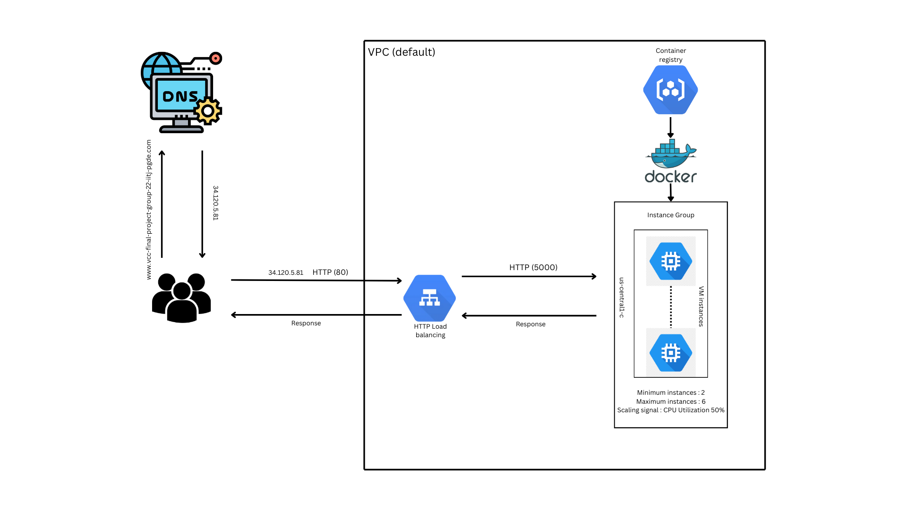
</p>

---

### Replication of the Project

Replication steps are provided for Debian OS and Google Cloud Platform.

**Steps to Follow:**

1. **Create a Project on Google Cloud Console**
   - Create a new project in Google Cloud.
   - Enable the Compute Engine API, Container API, and Load Balancing API.

2. **Set Up a Virtual Machine for Docker**
   - Create a new e2.medium instance, adjusting configurations as needed, and allow HTTP and HTTPS traffic.
   - SSH into the instance via the console and authenticate.
   - Update package lists:
     ```bash
     sudo apt-get update
     ```
   - Install Docker:
     ```bash
     sudo apt-get install -y docker.io
     ```
   - Add your user to the Docker group:
     ```bash
     sudo usermod -aG docker $USER
     ```
   - Log out and log back in to refresh group membership.

3. **Clone the Repository**
   - Clone this repository to the VM:
     ```bash
     git clone https://github.com/abhi-kr12/de-zoomcamp-playstore.git
     ```
   - Change to the project directory:
     ```bash
     cd VCC_Final-Project
     ```
   - Ensure the presence of directories: `static`, `templates`, and files: `.gitignore`, `app.py`, `Dockerfile`, `requirements.txt`.

4. **Download the Service Account Key**
   - In GCP, navigate to Service Accounts under IAM and create a new key for the service account used for this project.
   - Transfer the downloaded JSON file to the `VCC_Final-Project` folder in the VM and rename it to `vcc-main-project`.

5. **Test if the Code Works**
   - Change to the project directory:
     ```bash
     cd VCC_Final-Project
     ```
   - Build the Docker image:
     ```bash
     docker build -t vcc-web-app:latest .
     ```
   - Run the Docker image:
     ```bash
     docker run -p 5000:5000 vcc-web-app
     ```
   - Verify the Docker container is running. You should see a confirmation message.
   - Obtain the external IP of the instance from the console. Open your web browser and navigate to `http://VM_EXTERNAL_IP:5000`. If the website displays, all files are correct, and you can proceed further.

6. **Push the Docker Image to the Container Registry**
   - Tag the Docker image:
     ```bash
     docker tag vcc-web-app gcr.io/YOUR_PROJECT_ID/vcc-web-app
     ```
   - Push the Docker image to the container registry:
     ```bash
     docker push gcr.io/YOUR_PROJECT_ID/vcc-web-app
     ```
   <p align="center">
     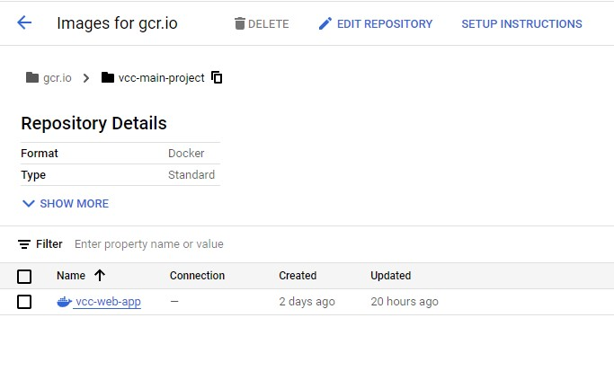
   </p>

7. **Create an Instance Template for the Instance Group**
   - Navigate to `Instance Templates` under `Compute Engine` in the console.
   - Configure the machine type and storage.
   - Under "Container," select "Deploy container" and enter `gcr.io/YOUR_PROJECT_ID/vcc-web-app` as the Docker image. Create the template.
   - You can also use the following shell script:

   ### Shell Script

   ```bash
   #!/bin/bash

   # Set variables
   PROJECT_ID="your-project-id"
   ZONE="us-central1-a"  # Change to your desired zone
   TEMPLATE_NAME="my-instance-template"
   MACHINE_TYPE="e2-medium"  # Change as needed
   IMAGE_FAMILY="debian-10"   # Change to your desired image family
   IMAGE_PROJECT="debian-cloud" # Change to your desired image project
   CONTAINER_IMAGE="gcr.io/YOUR_PROJECT_ID/vcc-web-app"  # Change to your container image

   # Create the instance template
   gcloud compute instance-templates create "$TEMPLATE_NAME" \
     --project="$PROJECT_ID" \
     --machine-type="$MACHINE_TYPE" \
     --image-family="$IMAGE_FAMILY" \
     --image-project="$IMAGE_PROJECT" \
     --tags=http-server,https-server \
     --container-image="$CONTAINER_IMAGE" \
     --zone="$ZONE"

   echo "Instance template '$TEMPLATE_NAME' created successfully with container deployment."
<p align="center"> 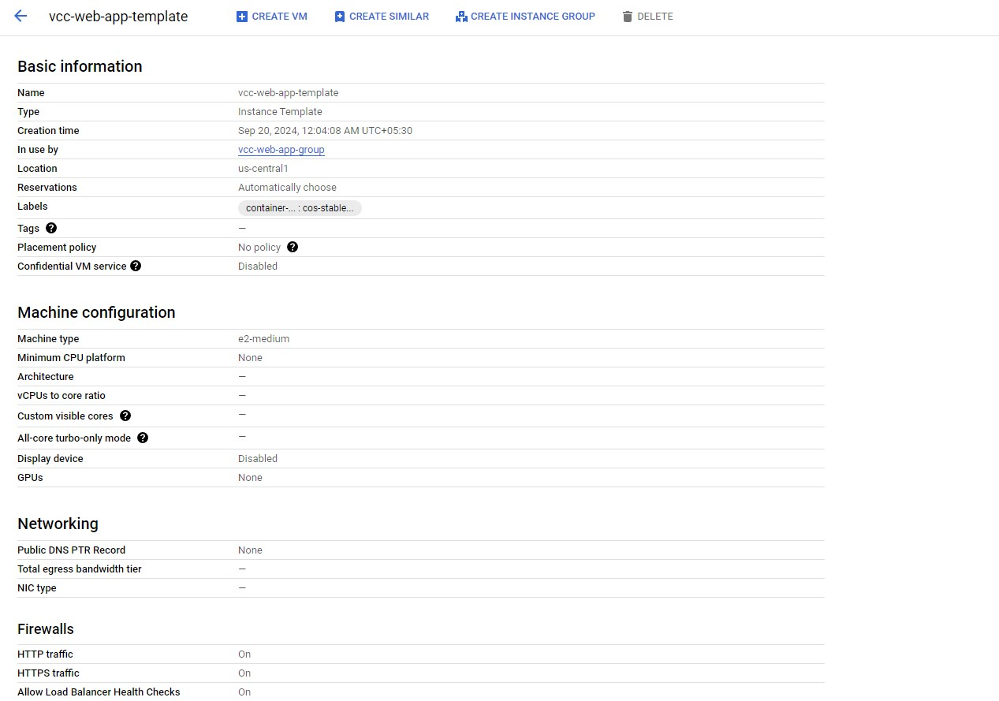 </p>

8. **Create an Instance Group Using the Instance Template**
   - Navigate to **Instance Groups** under **Compute Engine** in the Google Cloud Console.
   - Fill in the required fields:
     - **Name**: Choose a name for your instance group (e.g., `my-instance-group`).
     - **Zone**: Select the desired zone for your instance group.
     - **Instance Template**: Select the instance template you created earlier.
     - **Auto Scaling**: Configure the autoscaling settings:
       - **Mode**: Set to `On: add and remove instances to the group`.
       - **Minimum Instances**: Set to `2`.
       - **Maximum Instances**: Set to `6`.
       - **Autoscaling Signal**: Select `CPU Utilization` at `50%`.
   - Create a health check on port `5000` with the path `/health`.
   - Create the instance group. You can also use the following shell script:

   ### Shell Script

   ```bash
   #!/bin/bash

   # Set variables
   INSTANCE_GROUP_NAME="my-instance-group"
   ZONE="us-central1-a"  # Change to your desired zone
   TEMPLATE_NAME="my-instance-template"  # Name of your instance template

   # Create the instance group
   gcloud compute instance-groups managed create "$INSTANCE_GROUP_NAME" \
     --base-instance-name="$INSTANCE_GROUP_NAME" \
     --size=1 \
     --template="$TEMPLATE_NAME" \
     --zone="$ZONE"

   echo "Instance group '$INSTANCE_GROUP_NAME' created successfully."
<p align="center"> 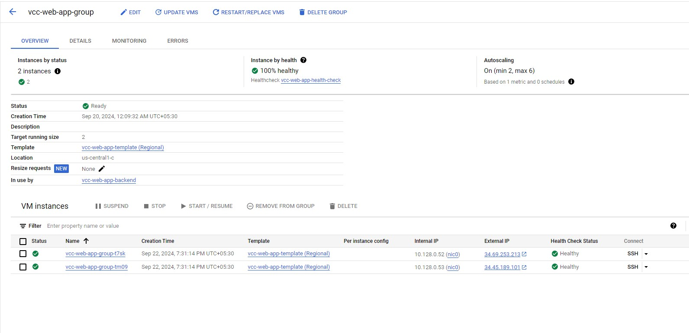 </p>

9. **Create a Load Balancer for the Instance Group**
   - Navigate to **Load Balancing** under **Network Services** in the Google Cloud Console.
   - Select **Application Load Balancer**, ensuring it is set to **Public Facing** and **Global Deployment**.
   - Configure the **Frontend** to use `HTTP` on port `80`.
   - Under **Backend Configuration**, choose the instance group created in the previous step. Be sure to add health checks for port `5000` to monitor the instance's health.
   - Set any required routing rules, assign a name to the load balancer, and click to create it.
   - Alternatively, you can use the following shell script to automate the creation:

   ### Shell Script

   ```bash
   #!/bin/bash

   # Set variables
   PROJECT_ID="your-project-id"
   REGION="us-central1"  # Change to your desired region
   LOAD_BALANCER_NAME="my-load-balancer"
   INSTANCE_GROUP_NAME="my-instance-group"  # Your managed instance group name
   HEALTH_CHECK_NAME="my-health-check"
   BACKEND_SERVICE_NAME="my-backend-service"
   FRONTEND_IP_NAME="my-frontend-ip"

   # Create a health check
   gcloud compute health-checks create http "$HEALTH_CHECK_NAME" \
     --port=80 \
     --request-path="/" \
     --project="$PROJECT_ID"

   # Create a backend service
   gcloud compute backend-services create "$BACKEND_SERVICE_NAME" \
     --load-balancing-scheme=EXTERNAL \
     --protocol=HTTP \
     --health-checks="$HEALTH_CHECK_NAME" \
     --global \
     --project="$PROJECT_ID"

   # Add the instance group to the backend service
   gcloud compute backend-services add-backend "$BACKEND_SERVICE_NAME" \
     --instance-group="$INSTANCE_GROUP_NAME" \
     --instance-group-zone="us-central1-a" \  # Change to your instance group zone
     --global \
     --project="$PROJECT_ID"

   # Create a global forwarding rule
   gcloud compute forwarding-rules create "$LOAD_BALANCER_NAME" \
     --global \
     --target-http-proxy="$LOAD_BALANCER_NAME-proxy" \
     --ports=80 \
     --address="$FRONTEND_IP_NAME" \
     --project="$PROJECT_ID"

   # Create a URL map
   gcloud compute url-maps create "$LOAD_BALANCER_NAME-proxy" \
     --default-service="$BACKEND_SERVICE_NAME" \
     --project="$PROJECT_ID"

   echo "Load balancer '$LOAD_BALANCER_NAME' created successfully."
<p align="center"> 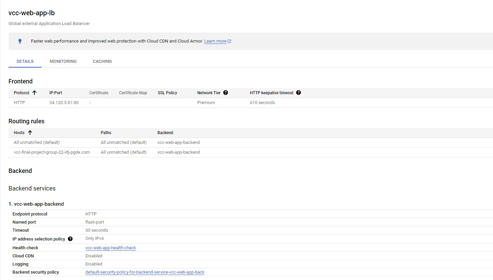 </p>

10. **Create a Domain Name (Optional)**
    - If you wish to have a custom domain, you can register a domain name through [Google Domains](https://domains.google).
    - Once you have your domain, update the DNS settings by adding an A record that points to the IP address of your load balancer.
    - This step is optional; you can access your application directly using the load balancer's IP address if preferred.
   
---

### Demonstration

- `CPU Utilization less than 50%` : The system is handling the load efficiently without triggering any scaling actions.
  - Instance group with CPU utilization below 50%
  <p align="center"> 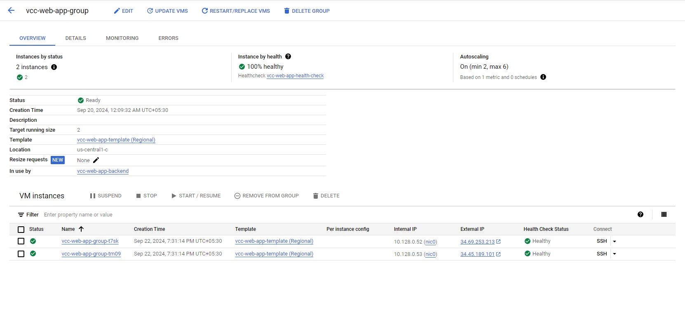 </p>
  - Instance group monitoring with CPU utilization below 50%
  <p align="center"> 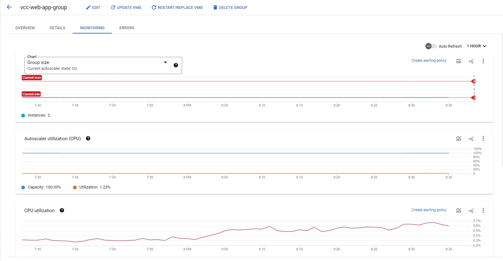 </p>
  - Website with CPU utilization below 50%
  <p align="center">  </p>
- `CPU Utilization greater than 50%` : Introducing CPU stress on one of the instances triggers the auto-scaling mechanism.
  - Introducing stress.
  <p align="center"> 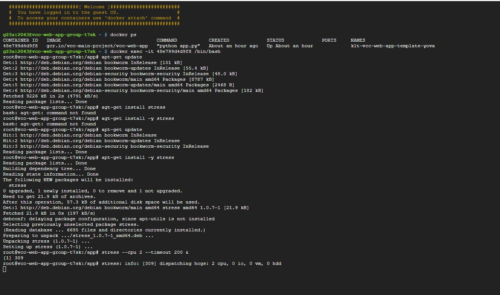 </p>
  - Instance group after CPU utilization goes above 50%
  <p align="center"> 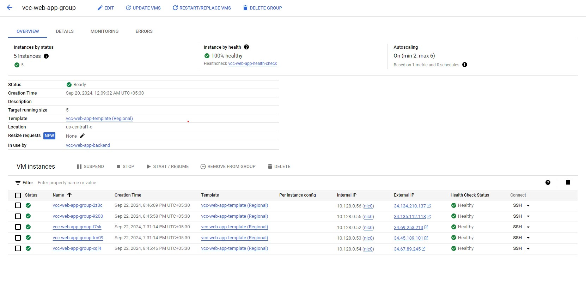 </p>
  - Instance group monitoring after CPU utilization goes above 50%
  <p align="center"> 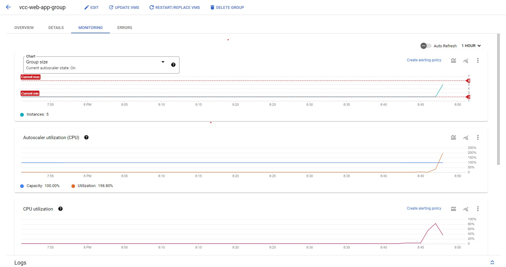 </p>
  - Website after CPU utilization goes above 50%
  <p align="center"> 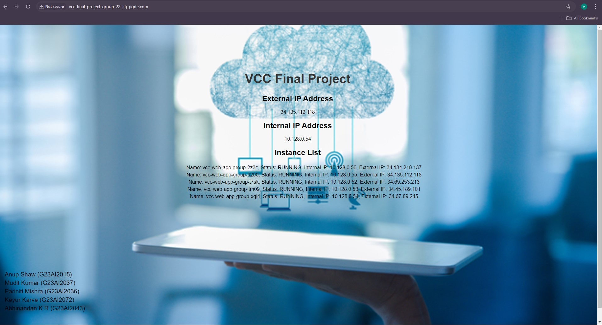 </p>

---

### Outcomes

- **Scalability**: Achieved automatic scaling of resources in response to varying traffic loads, ensuring optimal performance.
- **High Availability**: Maintained application responsiveness and uptime during peak usage, enhancing user experience.
- **Cost Efficiency**: Effectively reduced operational costs by dynamically managing resource allocation based on demand.
- **Improved User Experience**: Provided fast load times and reliable access, even under heavy traffic conditions.

---

### Future Enhancements

- **Enhanced Monitoring**: Integrate advanced monitoring solutions to gain deeper insights into application performance and user interactions.
- **Custom Scaling Policies**: Develop more nuanced autoscaling strategies based on metrics like memory usage and response time, beyond CPU utilization.
- **User Authentication**: Implement user authentication features to secure access and enable personalized experiences.
- **Multi-Region Support**: Expand deployment across multiple geographic regions to improve performance and redundancy.
- **Comprehensive Documentation**: Create detailed guides and tutorials to assist users in setting up and optimizing their deployments.

---
